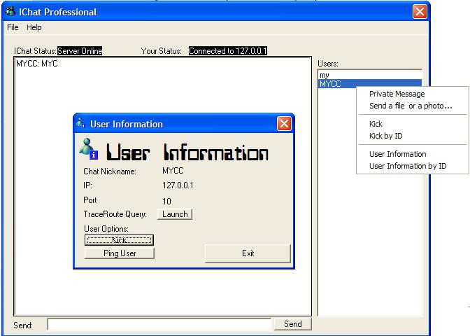



## Public And Private Chat, File Transfer, User Information\.\[Former IChat\]

### Description

This program will show you how to make a chat application. It will support an infinite number of users, file transfer, private messanges, hidden names... All written in simle code, easy to unerstand. Features: Public Chat, Private Chat, File Transfer, User Information,
 
### More Info
 
Host IP (if connecting)

Nothing If hosting

THE DESIRE TO LEARN!!!!

Full access to all the features for the host.

Chat and file transfer for others.

             |
---                |---
**Submitted On**   |2002-01-25 23:43:06
**By**             |[XA](https://github.com/Planet-Source-Code/PSCIndex/blob/master/ByAuthor/xa.md)
**Level**          |Intermediate
**User Rating**    |5.0 (15 globes from 3 users)
**Compatibility**  |VB 5\.0, VB 6\.0
**Category**       |[Internet/ HTML](https://github.com/Planet-Source-Code/PSCIndex/blob/master/ByCategory/internet-html__1-34.md)
**World**          |[Visual Basic](https://github.com/Planet-Source-Code/PSCIndex/blob/master/ByWorld/visual-basic.md)
**Archive File**   |[IChat\_Chat510691252002\.zip](https://github.com/Planet-Source-Code/xa-public-and-private-chat-file-transfer-user-information-former-ichat__1-31190/archive/master.zip)

### API Declarations

NONE!

